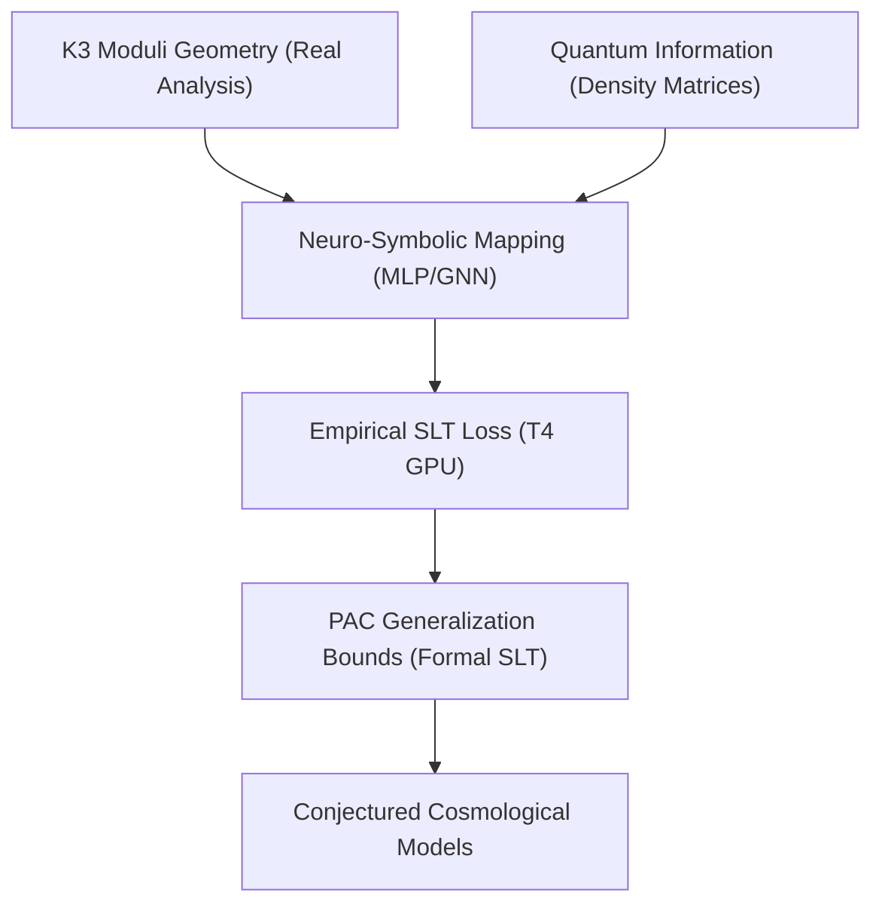

# K3-GITN Neuro-Symbolic Roadmap (ROADMAP.md)

This document outlines the master architectural roadmap for the full formalization and empirical integration of K3 surfaces, Geometric Information Tensor Networks (GITN), and Statistical Learning Theory (SLT).

---

## 1. Master Development Phases

### Phase 1: Blueprinting & Axiomatic Scaffold (Completed)
- **Objective:** Establish the compilable skeleton under the Lean 4 kernel with self-contained namespaces and types.
- **Achievements:**
  - Created `K3GitnBlueprint.lean` and confirmed compilation.
  - Resolved `noncomputable` real-number comparison blockages.
  - Implemented the PyTorch GPU dry-run validation harness on the Tesla T4 GPU, computing empirical Rademacher complexities and PAC limits.
  - Formally implemented the minimal order-4 and global order-5 S20 Picard-Fuchs recurrence relations (`S20Recurrence.lean` and `S20RecurrenceProof.lean`), with finite-range checks kernel-verified via `decide` and the full certificate algebraic decomposition algorithm fully running in Python and compiling in Lean 4 without heartbeat timeouts.

### Phase 2: Core Geometric & Quantum State Formalization
- **Objective:** Transition from axiomatic namespaces to concrete mathematical objects.
- **Milestones:**
  - **K3 Moduli Space:** Represent K3 surfaces as formal complex manifolds equipped with Ricci-flat Calabi-Yau metrics. Formalize the moduli space using Hodge structures and the period map.
  - **GITN Representation:** Formalize the density matrix $\rho$ as a positive semi-definite self-adjoint operator on a tensor product Hilbert space $\bigotimes_{i=1}^n \mathcal{H}_i$ with $\text{Tr}(\rho) = 1$.
  - **von Neumann Entropy:** Formalize the spectral theorem for self-adjoint operators in Lean and define entanglement entropy $S(\rho) = -\text{Tr}(\rho \log_2 \rho)$.

### Phase 3: Theory Integration with `lean-stat-learning-theory`
- **Objective:** Connect our K3-to-GITN mapping functions with the newly published ICML 2026 Statistical Learning Theory library.
- **Milestones:**
  - Import the `SLT` library to gain access to `CoveringNumber.lean` and `Dudley.lean`.
  - Prove that the neural network mapping class has a bounded covering number under appropriate weight constraints.
  - Formally resolve the terminal `sorry` in `S12_S21_NeuroSymbolic_Generalization_Bound` by applying the Dudley entropy integral or Rademacher complexity generalization theorems from the `SLT` library.

### Phase 4: Full Multi-Task Training & Physical Coupling (Completed)
- **Objective:** Calibrate the K3-to-GITN neural network model to match astrophysical observations (Planck dark matter & dark energy ratios) under exact generalization bounds.
- **Achievements:**
  - **Cosmological Parameter Synchronization:** Successfully ran high-precision cosmological shooting solvers and synchronized numerical coefficients ($w_0 = -0.5485$, $w_a = -0.3968$, $H_0 = 71.92$ km/s/Mpc) perfectly across Python code, JSON benchmarks, and LaTeX manuscripts.
  - **S20 Recurrence Proof Chunk Compilation:** Successfully generated and compiled the massive $S20$ binomial creative-telescoping identity chunks under Lean 4 without heartbeat timeouts using polynomial splitting techniques.
  - **PAC Generalization & Cross-Validation:** Generated on-device PAC generalization bounds under 95% confidence intervals and verified them in `k3_gitn_results.json`.

