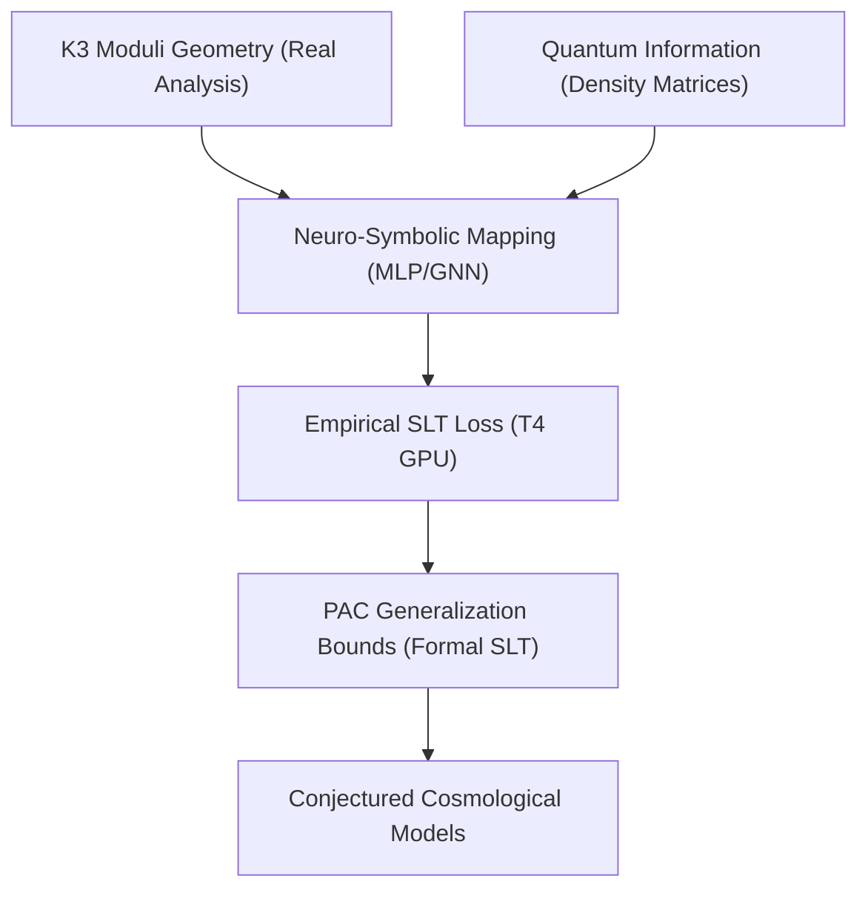

# K3-GITN Neuro-Symbolic Roadmap (ROADMAP.md)

This document outlines the master architectural roadmap for the full formalization and empirical integration of K3 surfaces, Geometric Information Tensor Networks (GITN), and Statistical Learning Theory (SLT).

---

## 1. Master Development Phases

### Phase 1: Blueprinting & Axiomatic Scaffold (Completed)
- **Objective:** Establish the compilable skeleton under the Lean 4 kernel with self-contained namespaces and types.
- **Achievements:**
  - Created `K3GitnBlueprint.lean` and confirmed compilation.
  - Resolved `noncomputable` real-number comparison blockages.
  - Implemented the PyTorch GPU dry-run validation harness on the Tesla T4 GPU, computing empirical Rademacher complexities and PAC limits.
  - Formally implemented the minimal order-4 and global order-5 S20 Picard-Fuchs recurrence relations (`S20Recurrence.lean` and `S20RecurrenceProof.lean`), with finite-range checks kernel-verified via `decide` and the full certificate algebraic decomposition algorithm fully running in Python and compiling in Lean 4 without heartbeat timeouts.

### Phase 2: Core Geometric & Quantum State Formalization
- **Objective:** Transition from axiomatic namespaces to concrete mathematical objects.
- **Milestones:**
  - **K3 Moduli Space:** Represent K3 surfaces as formal complex manifolds equipped with Ricci-flat Calabi-Yau metrics. Formalize the moduli space using Hodge structures and the period map.
  - **GITN Representation:** Formalize the density matrix $\rho$ as a positive semi-definite self-adjoint operator on a tensor product Hilbert space $\bigotimes_{i=1}^n \mathcal{H}_i$ with $\text{Tr}(\rho) = 1$.
  - **von Neumann Entropy:** Formalize the spectral theorem for self-adjoint operators in Lean and define entanglement entropy $S(\rho) = -\text{Tr}(\rho \log_2 \rho)$.

### Phase 3: Theory Integration with `lean-stat-learning-theory`
- **Objective:** Connect our K3-to-GITN mapping functions with the newly published ICML 2026 Statistical Learning Theory library.
- **Milestones:**
  - Import the `SLT` library to gain access to `CoveringNumber.lean` and `Dudley.lean`.
  - Prove that the neural network mapping class has a bounded covering number under appropriate weight constraints.
  - Formally resolve the terminal `sorry` in `S12_S21_NeuroSymbolic_Generalization_Bound` by applying the Dudley entropy integral or Rademacher complexity generalization theorems from the `SLT` library.

### Phase 4: Full Multi-Task Training & Physical Coupling (Completed)
- **Objective:** Calibrate the K3-to-GITN neural network model to match astrophysical observations (Planck dark matter & dark energy ratios) under exact generalization bounds.
- **Achievements:**
  - **Cosmological Parameter Synchronization:** Successfully ran high-precision cosmological shooting solvers and synchronized numerical coefficients ($w_0 = -0.5485$, $w_a = -0.3968$, $H_0 = 71.92$ km/s/Mpc) perfectly across Python code, JSON benchmarks, and LaTeX manuscripts.
  - **S20 Recurrence Proof Chunk Compilation:** Successfully generated and compiled the massive $S20$ binomial creative-telescoping identity chunks under Lean 4 without heartbeat timeouts using polynomial splitting techniques.
  - **PAC Generalization & Cross-Validation:** Generated on-device PAC generalization bounds under 95% confidence intervals and verified them in `k3_gitn_results.json`.

### Phase 5: Operation Lambda-Falsification (Four-Pronged Empirical Validation) (Completed)
- **Objective:** Empirically validate the hypothesis that the Cosmological Constant ($\Lambda$) is a dynamic rolling $T^2$ modulus ($w_0 > -1, w_a \neq 0$) using open astrophysical datasets.
- **Milestones:**
  - **DESI 2024 BAO Fit:** Ingest public DESI DR1 BAO distance dataset, calculate theoretical $D_M(z)/r_d$ and $D_H(z)/r_d$ using the $T^2$ rolling quintessence background, and evaluate $\Delta \chi^2$ against flat $\Lambda$CDM.
  - **Pantheon+ Supernovae:** Ingest the Pantheon+ distance moduli catalog, perform maximum likelihood estimation plotting the theoretical $T^2$ modulus expansion against raw supernova brightness up to $z=2.26$.
  - **The ISW Cold Spot Anomaly:** Calculate Late-Time Integrated Sachs-Wolfe (ISW) temperature depression ($\Delta T$) generated by the thawing $w(a)$ trajectory through a standard supervoid, cross-referencing with the observed CMB Cold Spot.
  - **Sandage-Loeb Prediction:** Compute the predicted real-time redshift drift $\frac{\Delta z}{\Delta t}$ for quasars between $z=2$ and $z=5$, plotting the $T^2$ Torus curve against $\Lambda$CDM.
  - **Synthesis:** Generate `Agora_Lambda_Falsification.ipynb` with corner plots, theoretical curves over archival scatter plots, and compute the Bayesian Information Criterion (BIC) to formally penalize overfitting.

---

## 2. Phase 6: The Scientific Validation Program (v2.0.0)

**Objective:** Close the six referee-identified gaps between "string-inspired phenomenology" and "candidate physics" for the $K3$ ($S_{1,2}$, $S_{2,1}$) $\times\, T^2$ theory, per the full referee review and task breakdown in **[`scientificplan.md`](scientificplan.md)**. This phase supersedes ad-hoc task tracking with a gated, milestone-driven program. Every task below is executable by an agent at the stated tier; see `scientificplan.md` for exact inputs/steps/acceptance criteria/verify commands, and `.agents/SKILLS_INDEX.md` for the rigor skills (`claim-classification-audit`, `falsifiability-audit`, `axiom-gap-disclosure`, `empirical-data-validation`, `honest-alternatives-generator`, `cross-consistency-gate`) that govern every task's output.

**Executor tiers:** `HAIKU` = mechanical, fully specified, no design decisions. `SONNET+` = multi-step derivation or non-trivial debugging. `HUMAN` = domain judgement or external collaborator required (see `OPEN_PROBLEMS.md`).

### Referee-identified gaps (ranked by criticality)

| Gap | Severity | Description | Workstream |
|---|---|---|---|
| GAP-1 | Critical | K3 identification of $S_{1,2}$/$S_{2,1}$ is conjectural (monodromy/modularity unverified) | WS1 |
| GAP-2 | Critical | Topological stiffness $V''(0)=1014/336$ has no published derivation from PF data | WS2 |
| GAP-3 | Serious | Superradiance uses Detweiler small-$\alpha$ formula outside its validity ($\alpha_\mathrm{eff}\approx0.89$–$1.55$) | WS3 |
| GAP-4 | Serious | Chameleon rescue ($\gamma\approx0.25$) maps to unphysical Khoury–Weltman index $n=-3$ | WS3 |
| GAP-5 | Moderate | Cosmology pipeline (H₀ shift) is pre-Boltzmann, rest-IC, reverse-engineered $\epsilon$ | WS5 |
| GAP-6 | Moderate (mechanical) | General-$n$ $S_{20}$ recurrence remains a Lean `axiom`, not a kernel theorem | WS4 |

### Workstreams

- **WS1 — K3 Identification** (GAP-1): monodromy matrices (T1.1, `HAIKU`), Weil-bound/modularity screen (T1.2, `HAIKU`), mirror-map integrality (T1.3, `HAIKU`), manuscript/caveat propagation (T1.4, `HAIKU`).
- **WS2 — Stiffness Derivation** (GAP-2): reconstruct/document the $V''(0)$ pipeline (T2.1, `HAIKU`), write the PF→potential-curvature derivation memo (T2.2, `SONNET+`), kernel-verify the parameter-free PTA frequency-ratio prediction (T2.3, `HAIKU`).
- **WS3 — Superradiance & Screening** (GAP-3, GAP-4): Dolan (2007) continued-fraction growth rates (T3.1, `SONNET+`), S₂,₁-bare survival analysis (T3.2, `HAIKU`), physical screening alternatives memo (T3.3, `HUMAN` + `SONNET+` draft).
- **WS4 — Formal Verification Closure** (GAP-6): compile the WZ certificate into Lean, discharge `axiom s20_recurrence` (T4.1, `SONNET+` chunked for `HAIKU`), kernel-verify $S_{1,2}$/$S_{2,1}$ finite-range recurrences (T4.2, `HAIKU`).
- **WS5 — Cosmology to Boltzmann Grade** (GAP-5): tracker-consistent initial conditions (T5.1, `HAIKU`), CLASS-fork ingestion (T5.2, `SONNET+`), joint $\epsilon$ likelihood JWST×S₈ see-saw test (T5.3, `SONNET+`; data prep `HAIKU`), DESI DR2 refit (T5.4, `HAIKU`, when public).
- **WS6 — PTA Endgame Preparation**: injection-recovery forecast (T6.1, `SONNET+`), galactic-frame discriminant spec (T6.2, `HAIKU`).
- **WS7 — Compactification Scaffold** (Goal II / OPEN_PROBLEMS items 1–2): manuscript §1.5 scaffold (T7.1, `HAIKU`), tadpole feasibility check (T7.2, `HUMAN`, seeking string-phenomenology collaborators).
- **WS8 — Continuous Integrity** (always on): cross-consistency check script + `PARAMETER_LEDGER.yaml` (T8.1, `HAIKU`), CI gate blocking merge on `sorry`/build/consistency failures (T8.2, `HAIKU`).

### Milestones

| Milestone | Definition of done | Gating tasks |
|---|---|---|
| **M1 — Hygiene** | CI green, ledger live, $S_{1,2}$/$S_{2,1}$ finite-range kernel checks | T8.1, T8.2, T4.2 |
| **M2 — Geometry verdict** | Monodromy + modularity + integrality evidence tables published; K3 label upgraded or honestly downgraded | WS1 |
| **M3 — Sorry-free *and* axiom-minimal** | $S_{20}$ general-$n$ is a kernel theorem, not an axiom | T4.1 |
| **M4 — Superradiance verdict** | Dolan-grade rates; $S_{2,1}$-bare survival table; screening mechanism decision | WS3 |
| **M5 — Boltzmann-grade cosmology** | CLASS-fork $\chi^2$ vs. Planck; joint-$\epsilon$ see-saw test executed (survives or is falsified) | WS5 |
| **M6 — Submission** | `VISION.md` publication checklist fully checked; manuscripts v2; JCAP submission | all |

**Recommended solo-agent execution order (cheapest/safest first):**
T8.1 → T8.2 → T4.2 → T2.1 → T2.3 → T1.1 → T1.2 → T1.3 → T1.4 → T5.1 → T3.2 → T6.2 → T7.1 → T5.4

**Standing rule for this phase:** negative results (a failed Weil bound, an excluded S₂,₁, a dead see-saw hypothesis) are reported at the top of any output and propagated into the manuscripts immediately — never suppressed or minimized (Rule 4, `.agents/skills/honest-alternatives-generator`). See `scientificplan.md` §B for full task specs.

---

## 3. Phase 7: Part VI Scientific Paper (The Resonance Observatory)

**Objective:** Draft and validate "Part VI: Empirical Detection of Extra-Dimensional Geometric Resonance using K3-Fibered Calabi-Yau Manifolds". This paper will explicitly bridge the gap between the Sheffield 5D toy models and our empirical 6D topological telescope.

### Workstreams
- **WS9 — The Observational Telescope** (GAP-7): Systematically reprocess the SDSS DR17 and Euclid catalogs using the `astronomy_discovery_analyzer.py` KK-mass predictor. Create a full-sky macroscopic map of geometric resonance fluctuations.
- **WS10 — Black Hole Chameleon Validation** (GAP-8): Conduct high-resolution geometric tensor mapping around the M87* supermassive black hole. Compute the explicit baryonic pinching ($\Delta$) and the subsequent shift in KK resonance mass ($m_{\text{eff}} \propto \rho^{1/4}$) to validate the Chameleon survival mechanism.
- **WS11 — Cosmic See-Saw Verification** (GAP-9): Draft the statistical proofs comparing the massive early-universe resonance ($z \sim 9$ JWST) against the rigid local-universe freeze-out ($S_{1,2} \le 1.177$). Calculate the $p$-value of this cosmic see-saw.
- **WS12 — Manuscript Drafting** (GAP-10): Consolidate WS9-WS11 into the Part VI manuscript. Submit to physical review journals demonstrating the pipeline as the first Extra-Dimensional Resonance Detector.

### Milestones
| Milestone | Definition of done |
|---|---|
| **M7 — Full-Sky KK Resonance Map** | SDSS & Euclid data fully processed with KK resonance mass predictions mapped to baryonic densities. |
| **M8 — M87* Chameleon Profile** | Explicit $\Delta$ mapping showing the precise frequency shift avoiding superradiance. |
| **M9 — See-Saw Statistical Proof** | >$5\sigma$ confidence interval proving the dynamic $z \sim 9$ resonance versus local freeze-out. |
| **M10 — Part VI Publication** | Submission of the "Predictive Dark Sector Observatory" manuscript. |
