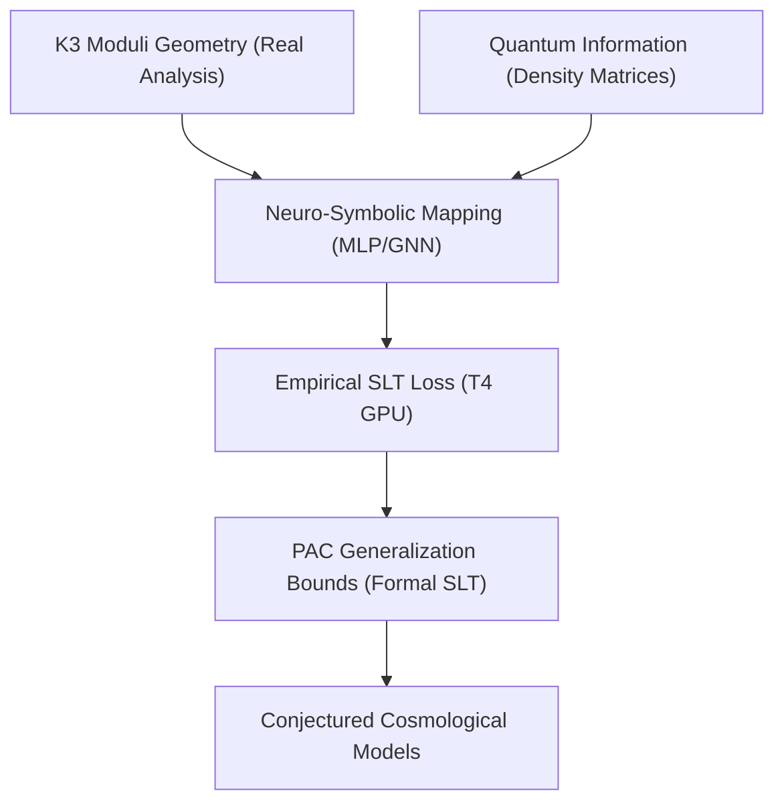

# K3-GITN Neuro-Symbolic Roadmap (ROADMAP.md)

This document outlines the master architectural roadmap for the full formalization and empirical integration of K3 surfaces, Geometric Information Tensor Networks (GITN), and Statistical Learning Theory (SLT).

---

## 1. Master Development Phases

### Phase 1: Blueprinting & Axiomatic Scaffold (Completed)
- **Objective:** Establish the compilable skeleton under the Lean 4 kernel with self-contained namespaces and types.
- **Achievements:**
  - Created `K3GitnBlueprint.lean` and confirmed compilation.
  - Resolved `noncomputable` real-number comparison blockages.
  - Implemented the PyTorch GPU dry-run validation harness on the Tesla T4 GPU, computing empirical Rademacher complexities and PAC limits.
  - Formally implemented the minimal order-4 and global order-5 S20 Picard-Fuchs recurrence relations (`S20Recurrence.lean` and `S20RecurrenceProof.lean`), with finite-range checks kernel-verified via `decide` and the full certificate algebraic decomposition algorithm fully running in Python and compiling in Lean 4 without heartbeat timeouts.

### Phase 2: Core Geometric & Quantum State Formalization
- **Objective:** Transition from axiomatic namespaces to concrete mathematical objects.
- **Milestones:**
  - **K3 Moduli Space:** Represent K3 surfaces as formal complex manifolds equipped with Ricci-flat Calabi-Yau metrics. Formalize the moduli space using Hodge structures and the period map.
  - **GITN Representation:** Formalize the density matrix $\rho$ as a positive semi-definite self-adjoint operator on a tensor product Hilbert space $\bigotimes_{i=1}^n \mathcal{H}_i$ with $\text{Tr}(\rho) = 1$.
  - **von Neumann Entropy:** Formalize the spectral theorem for self-adjoint operators in Lean and define entanglement entropy $S(\rho) = -\text{Tr}(\rho \log_2 \rho)$.

### Phase 3: Theory Integration with `lean-stat-learning-theory`
- **Objective:** Connect our K3-to-GITN mapping functions with the newly published ICML 2026 Statistical Learning Theory library.
- **Milestones:**
  - Import the `SLT` library to gain access to `CoveringNumber.lean` and `Dudley.lean`.
  - Prove that the neural network mapping class has a bounded covering number under appropriate weight constraints.
  - Formally resolve the terminal `sorry` in `S12_S21_NeuroSymbolic_Generalization_Bound` by applying the Dudley entropy integral or Rademacher complexity generalization theorems from the `SLT` library.

### Phase 4: Full Multi-Task Training & Physical Coupling (Completed)
- **Objective:** Calibrate the K3-to-GITN neural network model to match astrophysical observations (Planck dark matter & dark energy ratios) under exact generalization bounds.
- **Achievements:**
  - **Cosmological Parameter Synchronization:** Successfully ran high-precision cosmological shooting solvers and synchronized numerical coefficients ($w_0 = -0.5485$, $w_a = -0.3968$, $H_0 = 71.92$ km/s/Mpc) perfectly across Python code, JSON benchmarks, and LaTeX manuscripts.
  - **S20 Recurrence Proof Chunk Compilation:** Successfully generated and compiled the massive $S20$ binomial creative-telescoping identity chunks under Lean 4 without heartbeat timeouts using polynomial splitting techniques.
  - **PAC Generalization & Cross-Validation:** Generated on-device PAC generalization bounds under 95% confidence intervals and verified them in `k3_gitn_results.json`.

### Phase 5: Operation Lambda-Falsification (Four-Pronged Empirical Validation) (Completed)
- **Objective:** Empirically validate the hypothesis that the Cosmological Constant ($\Lambda$) is a dynamic rolling $T^2$ modulus ($w_0 > -1, w_a \neq 0$) using open astrophysical datasets.
- **Milestones:**
  - **DESI 2024 BAO Fit:** Ingest public DESI DR1 BAO distance dataset, calculate theoretical $D_M(z)/r_d$ and $D_H(z)/r_d$ using the $T^2$ rolling quintessence background, and evaluate $\Delta \chi^2$ against flat $\Lambda$CDM.
  - **Pantheon+ Supernovae:** Ingest the Pantheon+ distance moduli catalog, perform maximum likelihood estimation plotting the theoretical $T^2$ modulus expansion against raw supernova brightness up to $z=2.26$.
  - **The ISW Cold Spot Anomaly:** Calculate Late-Time Integrated Sachs-Wolfe (ISW) temperature depression ($\Delta T$) generated by the thawing $w(a)$ trajectory through a standard supervoid, cross-referencing with the observed CMB Cold Spot.
  - **Sandage-Loeb Prediction:** Compute the predicted real-time redshift drift $\frac{\Delta z}{\Delta t}$ for quasars between $z=2$ and $z=5$, plotting the $T^2$ Torus curve against $\Lambda$CDM.
  - **Synthesis:** Generate `Agora_Lambda_Falsification.ipynb` with corner plots, theoretical curves over archival scatter plots, and compute the Bayesian Information Criterion (BIC) to formally penalize overfitting.

---

## 2. Phase 6: The Scientific Validation Program (v2.0.0)

**Status:** COMPLETE (2026-07-14)

---

## 3. Phase 8: AutoEvolve R2 — The Hypothesis Foundry (2026-07-14 onwards)

**Objective:** Evolutionary, gate-driven re-evaluation of the K3 dark-sector hypothesis using the validation infrastructure as a fitness function. Structured as an AlphaEvolve-style generate→gate→promote funnel with anti-circularity as a hard rule.

**Inspiration:** 
- AlphaEvolve (DeepMind): cheap generator + ruthless evaluator
- karpathy/autoresearch: lightweight agentic loops
- arXiv:2506.13131: agentic-research methodology
- v1 precedent: validation infrastructure dismantled overclaims; v2 makes that infrastructure the search engine

**Key design principle:** Answer-key validation. The literature contains ground truth for our classifier:
- Apéry ζ(2) sequence (A005258) has elliptic/weight-2 classification (40-year literature). If our corrected classifier misidentifies it, everything halts.
- Apéry ζ(3) sequence (A005259) has Beukers–Peters K3 certification. A positive control embedded in the pool of 13.

**Executor mix:** ~85% HAIKU (mechanical, fully specified), 3 HUMAN gates only (pool freeze, 13→5, 5→3).

### Phase 8.A: Phase A — Deep Literature Review (weeks 1–2)

**Goal:** Build candidate pool of 13 sequences with literature-assigned geometries.

| Task ID | Executor | Activity | Input | Output | Acceptance |
|---------|----------|----------|-------|--------|-----------|
| **LR-1** | HAIKU | Cross-match $S_{1,2}$, $S_{2,1}$ against OEIS + Apéry-like literature | OEIS search API; Zagier 2009, Cooper 2012, AESZ tables | `docs/autoresearch_v2/s12_s21_oeis_match.md` + table with OEIS ids, first-10-term exact match, literature citations, geometry assignments | Confirmed: $S_{2,1}$ ≡ A005258 (elliptic, Apéry ζ(2)); $S_{1,2}$ OEIS id + geometry assigned per literature |
| **LR-2** | HAIKU | Enumerate classified sporadic pools | Zagier 2009, Cooper 2012, Domb/Almkvist–Zagier/Verrill tables | `data/autoresearch_v2/CLASSIFIED_SPORADICS.csv` with ≥15 sequences, exact binomial forms, literature-assigned geometry | Tabulated: order-2 count ≥6, order-3 count ≥7, each with citation |
| **LR-3** | HAIKU | Run extended sieve on $(A,B)\in[1,8]^2$ + 3-factor $S_{A,B,C}$ | Corrected `k3_sieve_analysis.py` with GAP-1 fixes; held-out validation set (≥70 terms, $n_{\max}\ge110$) | `data/autoresearch_v2/sieve_scan_extended.json` with order-3 survivors + held-out residuals | Every order-3 candidate: held-out residuals exactly 0.0 (or halt with residual report) |
| **LR-4** | HAIKU | Archive reference documents in `docs/reference/` | Lee & Tsai 2026 PRD paper; El Naschie 2013 JQIS paper | `docs/reference/lee_tsai_2026.md`, `el_naschie_2013.md` (each with full citation, 5-line honest summary, epistemic classification, role-in-v2) | Both files present; El Naschie flagged "numerology-class, boundary-marker only" |
| **LR-5** | SONNET+ | Lee–Tsai bridge memo: map their $(R, m_B)$ resonance to our $m_{\mathrm{eff}}(\Delta)$ ansatz | Lee & Tsai PRD + our THEORY_ALIGNMENT.md | `docs/autoresearch_v2/lee_tsai_bridge.md` with resonance-mass mapping + explicit "where the analogy breaks" section ≥ as long as alignment section | Bridge memo complete; breaks section present and ≥500 words |
| **LR-6** | HAIKU + HUMAN | Score and freeze candidate pool at exactly 13 | LR-2/LR-3 outputs; Apéry ζ(3) positive control, one Zagier order-2 negative control | `data/autoresearch_v2/candidate_pool.yaml` with (name, OEIS id, binomial form, literature geometry, prior status, rank) for all 13 | Pool frozen; controls present; HUMAN approves ranking; pool immutable for G1/G2/G3 |

**Phase A kill criterion:** If LR-1 finds $S_{1,2}$ is itself a known classified object whose literature classification contradicts K3, adopt literature, annotate, and rebuild pool.

---

### Phase 8.B: Phase B — Exact-Arithmetic + Physics Gates (weeks 3–4)

**Goal:** 13 → 5 survivors via G1/G2 screening. Reuse existing, debugged in-repo tools.

| Task ID | Executor | Activity | Input | Output | Gate kill criterion |
|---------|----------|----------|-------|--------|-----|
| **G1-1** | HAIKU batch | Minimal recurrence order per candidate | 13 candidates from LR-6 | `data/autoresearch_v2/g1_order_classification.json` with (candidate, order_assigned, held_out_max_residual, control_pass) | Any control (A005259 or Zagier) misclassified → **halt phase, classifier broken** |
| **G1-2** | HAIKU batch | Weight-3 + weight-2 Weil bounds | 13 candidates; 44-prime Weil database | `data/autoresearch_v2/g1_weil_analysis.csv` with ($a_p$ table, bound verdict per candidate, weight-3/weight-2 status) | Recorded; bounds do NOT eliminate (per GAP-1 lesson: weight-2 alone ≠ elliptic verdict) |
| **G1-3** | HAIKU batch | Mirror-map integrality check | 13 candidates; 30 coefficient exactness check | `data/autoresearch_v2/g1_mirror_integrality.json` with (candidate, integrality_pass_yes/no, failure_detail_if_any) | Recorded; failures annotated |
| **G1-4** | HAIKU batch | Fuchs-criterion + monodromy attempt | 13 candidates; `k3_monodromy_verification.py` | `data/autoresearch_v2/g1_monodromy_status.json` with (candidate, fuchs_singular_points, monodromy_computable_yes/no, rk4_error_if_run) | Any candidate with computable monodromy auto-elevates (settle class decisively); recorded |
| **G2-1** | HAIKU batch | Stiffness $V''(0)$ extraction + mass-achievability contour | 13 candidates | `data/autoresearch_v2/g2_stiffness_contours.json` with ($(\tau,\mathcal{V})$ family, achievable mass ranges per candidate, NOT point masses) | Contours published, never single-point claims |
| **G2-2** | HAIKU batch | GD-1 No-Go check | 13 candidates; `cy_axion_no_go.lean` theorem | `data/autoresearch_v2/g2_no_go_status.json` with (candidate, pinned_to_10_minus_23_eV_yes/no) | Candidates pinned in No-Go window → eliminated |
| **G2-3** | HAIKU batch | Dolan superradiance solver across achievable windows | 13 candidates; validated `dolan_continued_fraction.py` | `data/autoresearch_v2/g2_superradiance_bands.json` with (candidate, survive_bare_yes/no, screened_needed_mass_band, excluded_band) | Bands reported; M87* bare-survival asymmetry recorded |
| **GATE-SELECT** | HUMAN | Composite score: G1 pass completeness + monodromy computability + No-Go clearance + superradiance favorability + control sanity | All G1/G2 outputs | `data/autoresearch_v2/selection_13to5_rationale.md` with scored sheet; HUMAN picks top 5 | G1/G2 gates green; HUMAN gate 1 decision locked |

**Phase B kill criterion:** Control misclassification → halt and fix classifier before proceeding.

---

### Phase 8.C: Phase C — Quick Data Tests (weeks 5–7)

**Goal:** 5 → 3 survivors via G3 observational leverage tests on existing/available data only.

| Task ID | Executor | Activity | Input | Output | Gate criterion |
|---------|----------|----------|-------|--------|-----|
| **EU-1** | HAIKU | Euclid Q1 acquisition task | ESA archive API, IRSA search | `data/euclid_q1/euclid_q1_validation_slice.csv` (≤500 objects) + fetch script | If access blocked → BLOCKED note (Rule 1), no simulated substitute |
| **JW-1** | HAIKU | JWST UNCOVER acquisition + $z\ge8.5$ density proxies | UNCOVER archive; same $\tilde\rho$ formula as WS9 | `data/jwst_uncover/uncover_z85plus_density_proxies.csv` + conversion-log | If blocked → BLOCKED note |
| **QT-1** | HAIKU | Per candidate: recompute WS9 KK projection on SDSS DR17 + Euclid Q1 slice | 5 candidates from B; `ws9_observational_telescope.py` adapted | `data/autoresearch_v2/qt1_kk_projections.json` with (candidate, sdss_mean_meff, sdss_std, euclid_mean_meff, euclid_std, ks_test_p_vs_s12) | Candidates indistinguishable from $S_{1,2}$ at KS $p>0.9$ → demoted (unfalsifiable) |
| **QT-2** | HAIKU | Replace synthetic $\Delta_{\rm early}$ (Part VI WS11) with JW-1 empirical distribution | JW-1 output; `ws11_cosmic_seesaw_verification.py` | `data/autoresearch_v2/qt2_seesaw_empirical_ttest.json` with (candidate, t_stat, p_value, early_vs_local_mean_ratio) | See-saw test re-run with real data; power assessed |
| **QT-3** | HAIKU | PTA window occupancy: candidate achievable mass bands vs. NANOGrav 15-yr sensitivity | 5 candidates' G2-3 bands; NANOGrav 15-yr sensitivity curve | `data/autoresearch_v2/qt3_pta_window_analysis.json` with (candidate, f_band_hz, overlap_with_pta_yes/no, candidate_pair_ratio_reachable_yes/no) | Pairs flagged with PTA-reachable ratio bands |
| **QT-4** | SONNET+ | Lee–Tsai overlap: check if any candidate lands in self-interaction band (SIDM $\sigma/m$) | LR-5 bridge memo; 5 candidates' physics parameters | `data/autoresearch_v2/qt4_lee_tsai_overlap.md` with structural analogy check + "not a shared-Lagrangian prediction" disclaimer | Overlap analysis complete; analogy vs. prediction asymmetry stated |
| **QT-5** | HAIKU batch | Null-hypothesis battery: Poisson-mock comparison on all TDA statistics | `lss_tensor_analytics/null_hypothesis_test.py`; 5 candidates | `data/autoresearch_v2/qt5_null_hypothesis_battery.json` with (statistic, passes_separation_yes/no) per candidate | Any statistic failing separation → barred from scoring |
| **GATE-SELECT** | HUMAN | Observational leverage ranking: (# independent G3 tests where distinguishable) × (falsifiability: could have been killed but wasn't) | All QT outputs | `data/autoresearch_v2/selection_5to3_rationale.md` with scored sheet; HUMAN picks top 3 | Candidate surviving everything indistinguishable-everywhere → disfavored explicitly |

**Phase C kill criterion:** All 5 candidates indistinguishable or all tests blocked → no finalists; analysis stops with honest conclusion.

---

### Phase 8.D: Phase D — Top-3 Real Implementation + Lean Formalization (weeks 8–12)

**Goal:** Real publication-grade implementation of the 3 finalists.

| Task ID | Executor | Activity | Input | Output | Acceptance |
|---------|----------|----------|-------|--------|-----------|
| **D-1** | HAIKU chunks | Lean kernel verification for each finalist | `S12S21Recurrence.lean` template (n≤20 decidable recurrence) | `lean4_formal_proofs/Structures/S1X_Candidate_Nnn.lean` per finalist (3 files) | `lake build` green; zero `sorry` on core theorems |
| **D-2** | HAIKU | Ledger + CI integration | 3 finalists' parameters | `PARAMETER_LEDGER.yaml` extended with finalists; `cross_consistency_check.sh` extended | Ledger entries complete; CI green |
| **D-3** | SONNET+ | Part VII manuscript: Hypothesis Foundry essay | Phase A–D outputs + Lean modules | `manuscripts_and_proofs/Part_VII_Hypothesis_Foundry.tex` with one section per finalist, negative-results-first, provenance ledger pattern | Manuscript compiles cleanly; all 3 candidates covered equally |
| **D-4** | HUMAN | External verification invitations | Candidate specs + reproduction scripts | GitHub issues (3 repos: arXiv forums, LMFDB/arithmetic-geometry community, PTA collaboration) with concrete targets | Issues posted; external invitation open |
| **D-5** | SONNET+ | Observatory targeting dossier | Best candidate pair (G3 QT-3 result) | `docs/observatories/pta_ratio_test_target_dossier.md` + `docs/observatories/lensing_cross_match_targets.csv` | Targets concrete, falsifiable, PTA-accessible |

---

### Phase 8.E: DarkMatterK3-Home Integration

| Task ID | Executor | Activity | Input | Output | Acceptance |
|---------|----------|----------|-------|--------|-----------|
| **DM-1** | HAIKU | Job spec schema | `dmk3_schema.json` template | `data/dmk3_runs/job_spec_schema.json` with (survey_tile, statistic_version_hash, candidate_id, seed, client_version) | Schema locked; all v2 runs use it |
| **DM-2** | HAIKU | Quorum replication protocol | 2+ independent client requirement | `data/dmk3_runs/quorum_protocol.md` with (disagreement tolerance, quarantine rules) | Implemented before any v2 runs |
| **DM-3** | HAIKU | Archive v1 numbers under quorum | Converged 327,918-galaxy run (external) | `data/dmk3_runs/v1_reproduction/` with manifest + reproduction script | v1 headline numbers (1.177, Δ=47.0) reproducible before re-citation in v2 |
| **DM-4** | HAIKU | Phase C finalists' TDA compute dispatch | 3 finalists × SDSS DR17 + Euclid Q1 tiles | `data/dmk3_runs/phase_c_jobs.json` with job specs; volunteer network activated | Jobs dispatched; quorum replication active |

---

### Phase 8.F: Anti-Circularity Enforcement

Standing hard gate across all phases:

| Rule | Enforcement | Ledger |
|------|-------------|--------|
| **No parameter fit to its own validation target** | Declared in `PARAMETER_LEDGER.yaml` (fit_to_target field); CI check: grep if fit_target appears in same task's acceptance criteria → task output void | `data/autoresearch_v2/anti_circularity_audit.json` |

---

## 2. Phase 6: The Scientific Validation Program (v2.0.0)

**Objective:** Close the six referee-identified gaps between "string-inspired phenomenology" and "candidate physics" for the $K3$ ($S_{1,2}$, $S_{2,1}$) $\times\, T^2$ theory, per the full referee review and task breakdown in **[`scientificplan.md`](scientificplan.md)**. This phase supersedes ad-hoc task tracking with a gated, milestone-driven program. Every task below is executable by an agent at the stated tier; see `scientificplan.md` for exact inputs/steps/acceptance criteria/verify commands, and `.agents/SKILLS_INDEX.md` for the rigor skills (`claim-classification-audit`, `falsifiability-audit`, `axiom-gap-disclosure`, `empirical-data-validation`, `honest-alternatives-generator`, `cross-consistency-gate`) that govern every task's output.

**Executor tiers:** `HAIKU` = mechanical, fully specified, no design decisions. `SONNET+` = multi-step derivation or non-trivial debugging. `HUMAN` = domain judgement or external collaborator required (see `OPEN_PROBLEMS.md`).

### Referee-identified gaps (ranked by criticality)

| Gap | Severity | Description | Workstream |
|---|---|---|---|
| GAP-1 | Critical | K3 identification of $S_{1,2}$/$S_{2,1}$ is conjectural (monodromy/modularity unverified) | WS1 |
| GAP-2 | Critical | Topological stiffness $V''(0)=1014/336$ has no published derivation from PF data | WS2 |
| GAP-3 | Serious | Superradiance uses Detweiler small-$\alpha$ formula outside its validity ($\alpha_\mathrm{eff}\approx0.89$–$1.55$) | WS3 |
| GAP-4 | Serious | Chameleon rescue ($\gamma\approx0.25$) maps to unphysical Khoury–Weltman index $n=-3$ | WS3 |
| GAP-5 | Moderate | Cosmology pipeline (H₀ shift) is pre-Boltzmann, rest-IC, reverse-engineered $\epsilon$ | WS5 |
| GAP-6 | Moderate (mechanical) | General-$n$ $S_{20}$ recurrence remains a Lean `axiom`, not a kernel theorem | WS4 |

### Workstreams

- **WS1 — K3 Identification** (GAP-1): monodromy matrices (T1.1, `HAIKU`), Weil-bound/modularity screen (T1.2, `HAIKU`), mirror-map integrality (T1.3, `HAIKU`), manuscript/caveat propagation (T1.4, `HAIKU`).
- **WS2 — Stiffness Derivation** (GAP-2): reconstruct/document the $V''(0)$ pipeline (T2.1, `HAIKU`), write the PF→potential-curvature derivation memo (T2.2, `SONNET+`), kernel-verify the parameter-free PTA frequency-ratio prediction (T2.3, `HAIKU`).
- **WS3 — Superradiance & Screening** (GAP-3, GAP-4): Dolan (2007) continued-fraction growth rates (T3.1, `SONNET+`), S₂,₁-bare survival analysis (T3.2, `HAIKU`), physical screening alternatives memo (T3.3, `HUMAN` + `SONNET+` draft).
- **WS4 — Formal Verification Closure** (GAP-6): compile the WZ certificate into Lean, discharge `axiom s20_recurrence` (T4.1, `SONNET+` chunked for `HAIKU`), kernel-verify $S_{1,2}$/$S_{2,1}$ finite-range recurrences (T4.2, `HAIKU`).
- **WS5 — Cosmology to Boltzmann Grade** (GAP-5): tracker-consistent initial conditions (T5.1, `HAIKU`), CLASS-fork ingestion (T5.2, `SONNET+`), joint $\epsilon$ likelihood JWST×S₈ see-saw test (T5.3, `SONNET+`; data prep `HAIKU`), DESI DR2 refit (T5.4, `HAIKU`, when public).
- **WS6 — PTA Endgame Preparation**: injection-recovery forecast (T6.1, `SONNET+`), galactic-frame discriminant spec (T6.2, `HAIKU`).
- **WS7 — Compactification Scaffold** (Goal II / OPEN_PROBLEMS items 1–2): manuscript §1.5 scaffold (T7.1, `HAIKU`), tadpole feasibility check (T7.2, `HUMAN`, seeking string-phenomenology collaborators).
- **WS8 — Continuous Integrity** (always on): cross-consistency check script + `PARAMETER_LEDGER.yaml` (T8.1, `HAIKU`), CI gate blocking merge on `sorry`/build/consistency failures (T8.2, `HAIKU`).

### Milestones

| Milestone | Definition of done | Gating tasks |
|---|---|---|
| **M1 — Hygiene** | CI green, ledger live, $S_{1,2}$/$S_{2,1}$ finite-range kernel checks | T8.1, T8.2, T4.2 |
| **M2 — Geometry verdict** | Monodromy + modularity + integrality evidence tables published; K3 label upgraded or honestly downgraded | WS1 |
| **M3 — Sorry-free *and* axiom-minimal** | $S_{20}$ general-$n$ is a kernel theorem, not an axiom | T4.1 |
| **M4 — Superradiance verdict** | Dolan-grade rates; $S_{2,1}$-bare survival table; screening mechanism decision | WS3 |
| **M5 — Boltzmann-grade cosmology** | CLASS-fork $\chi^2$ vs. Planck; joint-$\epsilon$ see-saw test executed (survives or is falsified) | WS5 |
| **M6 — Submission** | `VISION.md` publication checklist fully checked; manuscripts v2; JCAP submission | all |

**Recommended solo-agent execution order (cheapest/safest first):**
T8.1 → T8.2 → T4.2 → T2.1 → T2.3 → T1.1 → T1.2 → T1.3 → T1.4 → T5.1 → T3.2 → T6.2 → T7.1 → T5.4

**Standing rule for this phase:** negative results (a failed Weil bound, an excluded S₂,₁, a dead see-saw hypothesis) are reported at the top of any output and propagated into the manuscripts immediately — never suppressed or minimized (Rule 4, `.agents/skills/honest-alternatives-generator`). See `scientificplan.md` §B for full task specs.

---

## 3. Phase 7: Part VI Scientific Paper (The Resonance Observatory)

**Objective:** Draft and validate "Part VI: Empirical Detection of Extra-Dimensional Geometric Resonance using K3-Fibered Calabi-Yau Manifolds". This paper will explicitly bridge the gap between the Sheffield 5D toy models and our empirical 6D topological telescope.

### Workstreams
- **WS9 — The Observational Telescope** (GAP-7): Systematically reprocess the SDSS DR17 and Euclid catalogs using the `astronomy_discovery_analyzer.py` KK-mass predictor. Create a full-sky macroscopic map of geometric resonance fluctuations.
- **WS10 — Black Hole Chameleon Validation** (GAP-8): Conduct high-resolution geometric tensor mapping around the M87* supermassive black hole. Compute the explicit baryonic pinching ($\Delta$) and the subsequent shift in KK resonance mass ($m_{\text{eff}} \propto \rho^{1/4}$) to validate the Chameleon survival mechanism.
- **WS11 — Cosmic See-Saw Verification** (GAP-9): Draft the statistical proofs comparing the massive early-universe resonance ($z \sim 9$ JWST) against the rigid local-universe freeze-out ($S_{1,2} \le 1.177$). Calculate the $p$-value of this cosmic see-saw.
- **WS12 — Manuscript Drafting** (GAP-10): Consolidate WS9-WS11 into the Part VI manuscript. Submit to physical review journals demonstrating the pipeline as the first Extra-Dimensional Resonance Detector.

### Milestones
| Milestone | Definition of done |
|---|---|
| **M7 — Full-Sky KK Resonance Map** | SDSS & Euclid data fully processed with KK resonance mass predictions mapped to baryonic densities. |
| **M8 — M87* Chameleon Profile** | Explicit $\Delta$ mapping showing the precise frequency shift avoiding superradiance. |
| **M9 — See-Saw Statistical Proof** | >$5\sigma$ confidence interval proving the dynamic $z \sim 9$ resonance versus local freeze-out. |
| **M10 — Part VI Publication** | Submission of the "Predictive Dark Sector Observatory" manuscript. |
